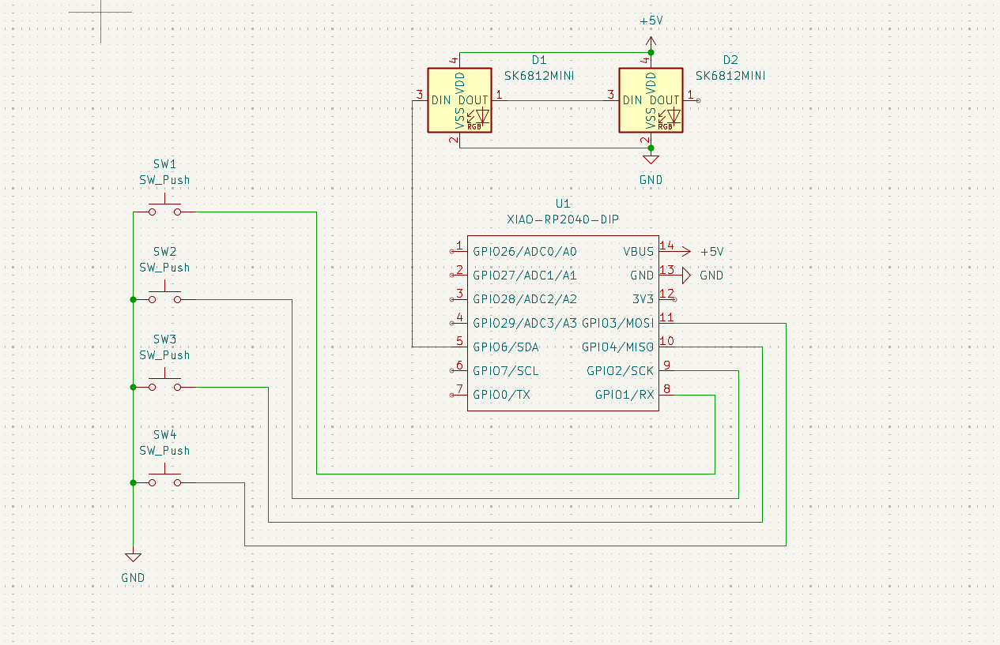
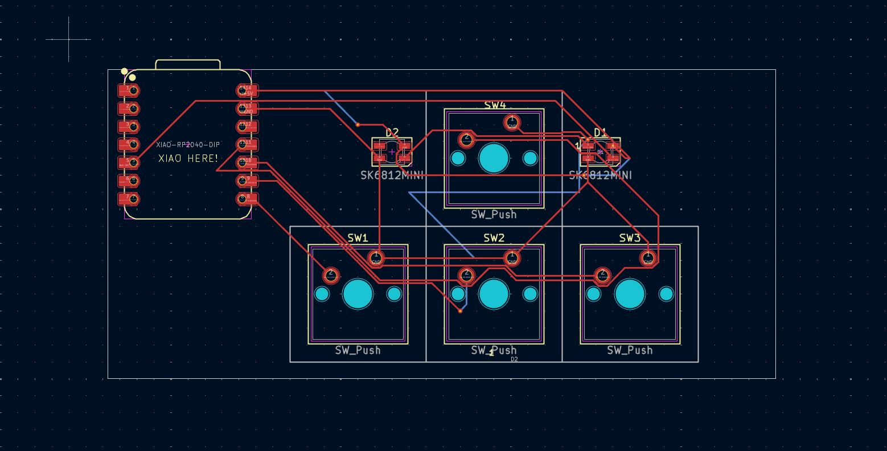
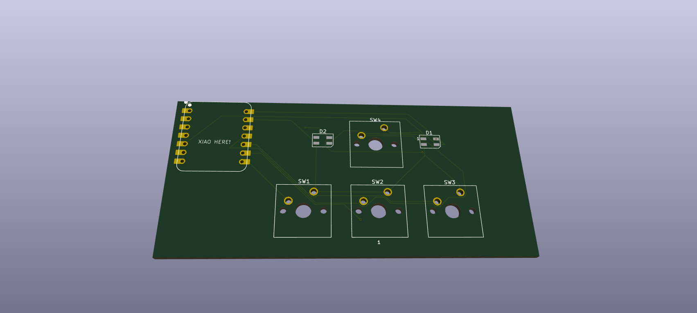
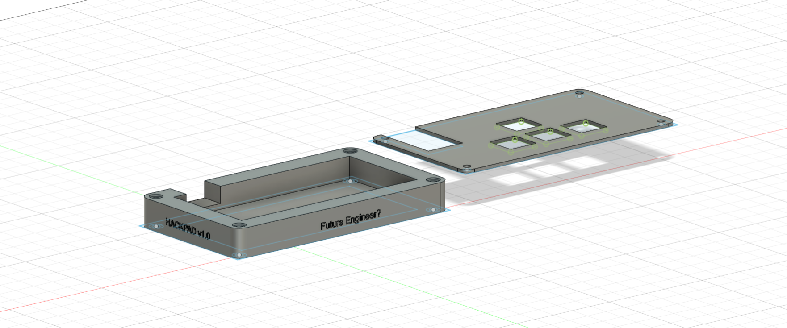

# My-Hackpad

## Project Description
My project is a custom macropad designed with KiCad and Autodesk Fusion, and programmed with KMK Firmware. 

### How I'll use it:
I'm setting this up to handle my daily shortcuts.
 One-tap to open Spotify and play/pause my playlists.
 I’m mapping keys to open my most-used apps like my browser or my code editor instantly.
 Simple things like "Mute/Unmute" or "Screenshot" that are usually awkward to do on a laptop keyboard.

### Why I made this:
My friends told me about Hack Club Blueprint and suggested I do a guided project since I was a complete beginner. I found the macropad interesting and challenged myself to build a piece of hardware with no prior experience to see if I could do it!
### Project Gallery

#### Circuit Schematic

#### PCB Layout (2D & 3D)

#### 3D Printed Case

